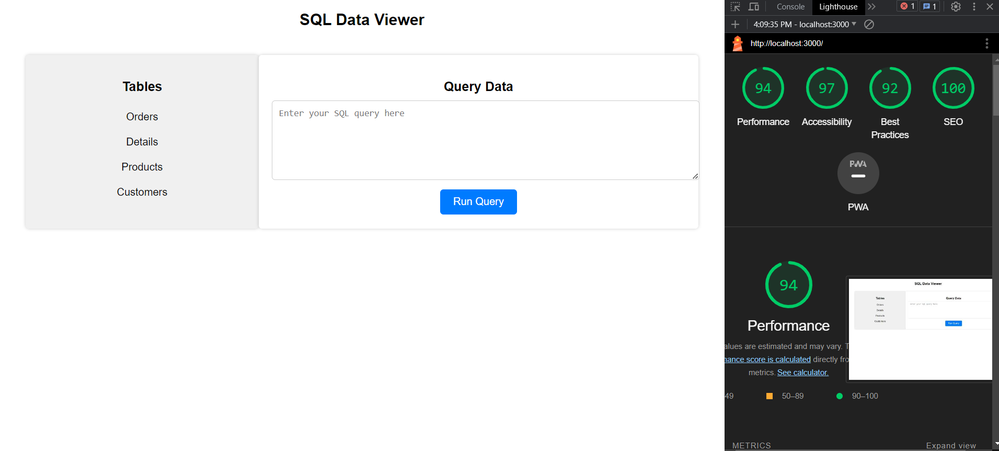
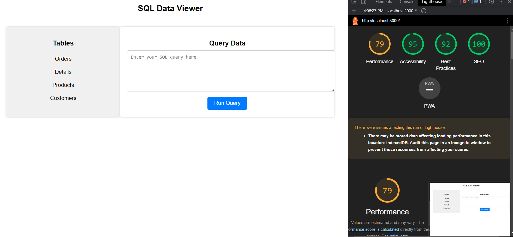

# SQL Editor- Atlan Assignment

**Task :** Create a SQL editor view where your users can query easily on a table using SQL, and see the results.

The app is deployed at : **https://sql-editor-chi.vercel.app/**

App fulfils all the requirements that were mentioned by team Atlan.

You can run different queries on the table and view data of each table.

## Features:

- SQL Editor with syntax highlighting. Queries can be run and the editor can be cleared as well.
- Tables can be exported to csv files.

## Major libraries

1. React
2. papaparse
3. React-Ace

## Data

I have used csv files provided by team Atlan and useed papaparse to loaded it anytime a query is demanding the data to be retrieved from the file.

## Steps taken to Optimize

1. Import for `react-ace` editor was long tasks running during page load, Converted it to Lazy loaded component using `React.lazy()` for code-splitting and delaying it's loading.
2. The Suspense component is used to handle loading while the components are fetched.
3. The React's React.memo and lazy-loading using React.lazy. React.memo will help prevent unnecessary re-renders of these components when their props haven't changed
4. Only importing used Module in a component from library rather than importing whole library.

## Performance

- Using react-ace for code splitting and pre rendering pages for increased performance.
- Lazy loading components like the editor and the table using dynamic imports.

Page Load TIme has been calculated by using the [Lighthouse Tool](https://developers.google.com/web/tools/lighthouse).
Old Performance

After optimiztion

## User Interface

- I have tried to keep the UI very clean and simple for better user experience.
- The app is fully responsive

## Screenshots
